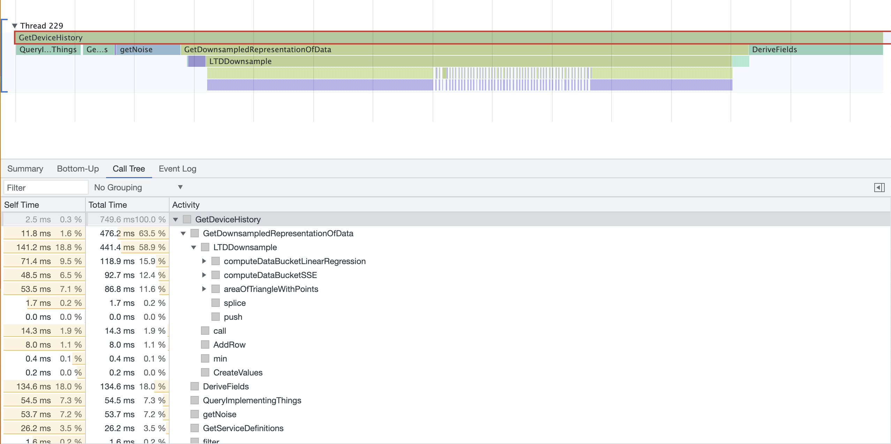

# Intro

A thingworx extension that allows profiling blocks of code, creating reports that can be viewed using the Chrome performance inspector. It is primarily meant to be used with typescript projects created using [ThingworxVSCodeProject](https://github.com/BogdanMihaiciuc/ThingworxVSCodeProject) using the `--trace` flag.

# How to use

The first step is to install this extension. You can either download the latest release and install it directly or build it from this repo. If you are prompted to restart the Thingworx server after installing, do so.

The extension creates a `BMProfiler` thing that contains two services:
 - `beginProfiling` - should be executed to start a profiling session on the system.
 - `finishProfiling` - should be executed to finish the current profiling session and generate a report file. The service returns a URL to download the report file.

While a profile session is active, all trace events are recorded in memory until it is stopped.

## With typescript projects

The easiest way to generate trace events is to build your thingworx typescript project with the `--trace` flag. This will automatically add trace events to all function and service invocations in your project.

Note that projects built with the `--trace` flag require the profiler extension to be installed on the server they are deployed to, otherwise all services will fail to run.

## Standalone

It is also possible to use this without typescript projects. To do this, you can manually generate trace events from within your services:
```js
// Obtain the profiler instance for the current thread
const profiler = BMProfilerRuntime.localProfiler;

// Activate the profiler
profiler.retain();
try {

    // Generate a start event, passing in the name with which this block will appear in the report
    profiler.start('MyCodeBlock');

    // ... code to measure

    // End the measurement
    profiler.end();

}
finally {
    // Deactivate the profiler. Make sure to call this in a finally block
    // to ensure that it does not remain activated when an exception is thrown
    profiler.release();
}
```

## Viewing the results

There are several tools that can open the reports generated by the profiler. 

### Chrome inspector
The easiest to use is the chrome inspector. To view profiles using it, open the inspector for any page, select the `Performance` tab, then drag & drop any profile report into the inspector window or use the `Load Profile` button to select a file from your system. The report should load in the inspector window and you should be able to navigate through same as with any chrome profile report:



When viewing trace reports generated from typescript projects, the various calls will be color coded based on where the function originates. Although the colors may be different on your system, they will be consistent across the categories. In the example above:
 - Lime green represents functions defined in your typescript project
 - Green represents thingworx built-in services
 - Purple represents standard javascript functions
 - Blue represents functions whose location could not be determined
 - Although not represented in the example, functions invoked from imported entities also get their own category

The categories are determined at compile time, so they aren't always guaranteed to be accurate. In particular, anthing invoked on an `any` type will be added to the "undetermined location" category.

### Chrome trace viewer
An alternative is the chrome trace viewer. To view reports in the trace viewer, navigate to `about:tracing` in the chrome browser and drop your report in the page, or use the `Load` button to select it from your system. Just like in the inspector, the calls are color-coded based on their locations. In this tool, the colors are:
 - Pink is used for project functions
 - Blue is used for built-in services
 - Green is used of standard javascript functions
 - Gray is used for unknown functions

### Perfetto

A cross-browser solution is using [Perfetto](https://ui.perfetto.dev). This works in any browser, but doesn't seem to handle larger traces very well. To use it, navigate to the [Perfetto](https://ui.perfetto.dev) app, then drop your report in that page.

# Development

## Pre-Requisites

The following software is required:

* [NodeJS](https://nodejs.org/en/): needs to be installed and added to the `PATH`. You should use the LTS version (v14+).
* [JDK](https://www.oracle.com/java/technologies/downloads/) needs to be installed and added to the `PATH`.

The following software is recommended:

* [Visual Studio Code](https://code.visualstudio.com/): An integrated developer enviroment with great javascript and typescript support. You can also use any IDE of your liking, it just that most of the testing was done using VSCode.

The java libraries are also required to be able to build the java extension. They should go in the `lib` folder:
* Thingworx Extension SDK - obtain this from your PTC support account
* `rhino` - obtain this from your local thingworx installation

## Build

To build the extension, run `npm run build` in the root of the project. This will generate an extension .zip file in the zip folder in the root of the project.

## Deployment

To deploy to the thingworx server, you can manually install the extension that is generated in the zip folder in the root of the project.

# Disclaimer

The BMProfiler extension is not an official Thingworx product. It is something developed to improve the life of Thingworx developers and it is not supported by PTC.

# License

[MIT License](license)
